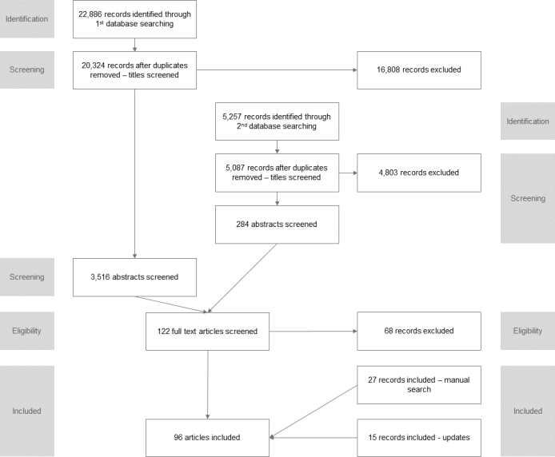

```{r setup, include=FALSE}
knitr::opts_chunk$set(echo = FALSE)

library(pacman)
p_load(tidyverse, readxl, knitr, sjmisc, sjPlot, scales)

```

```{r data, include=FALSE}
main <- read_excel("./data/TEMPO_SR_2019-08-13.xlsx", sheet = "Main") %>% 
  replace(is.na(.), "") %>% 
  select(-Peer_review, -Theory, -Data_base, 
         -Est_start, -Est_end, 
         -Est_tunit_1, -Est_tunit_2, -Est_tunit_3,
         Char) %>% 
  mutate(Est_pop_size = as.numeric(Est_pop_size),
         Data_size_users = as.numeric(Data_size_users),
         Data_size_activities = as.numeric(Data_size_activities),
         Est_tunit_num = as.numeric(Est_tunit_num),
         Est_spat_num_1 = as.numeric(Est_spat_num_1),
         Est_spat_num_2 = as.numeric(Est_spat_num_2))

# View(main)
```

# Abstract {-}

**BACKGROUND**
The estimation of temporary populations is a well-established field, but despite growing interest they are yet to form part of the standard suite of official population statistics. 

**OBJECTIVE**
This systematic review seeks to review the empirical literature on temporary population estimation and identify the contemporary "state of the art". 

**RESULTS**
We identify a total of `r nrow(main)` studies that attempt to estimate or describe a method of estimation. Our findings reveal strong growth in the number of studies in recent decades that in part has been driven by the rise in both the type and availability of new sources of information, including mobile phone data. What emerges from this systematic review is the lack of any “gold standard” data source or methodology for temporary population estimation. 

**CONCLUSIONS**
The review points to a number of important challenges that remain for estimating temporary populations, both conceptually and practically. What remains is the need for clear definitions along with identification of appropriate data and methods that are able to robustly capture and measure the diverse array of spatial behaviours that drive temporary population dynamics. 

**CONTRIBUTION**
To our knowledge, this a first review on this topic that brings together literature from various disciplines and collects methods used for estimation.

**Keywords:** temporary populations, daytime populations, service populations, seasonal populations, real-time census, social sensing, systematic review

# Background

Conventional population estimates capture a population at a single point in time. In doing so, such estimates ignore the short-term dynamism of populations that are caused by temporary population mobility, a territorial movement that does not result in a permanent change of usual residence [@bellComparingTemporaryMobility2000]. Temporary population movements are defined as moves of one or more night’s duration but can be broadened to also include diurnal movements such as daily commuting  [@smithMethodologyEstimatingTemporary1989]. Temporary population mobility can exert substantive impacts on both the size and composition of populations at the small-area level [@charles-edwardsElsewhereAustraliaSnapshot2018] impacting traffic, housing, retail sales, medical services and emergency preparedness to name a select few  [@smithMethodologyEstimatingTemporary1989; @smithTemporaryMigrationCase2007]. As a consequence of these impacts, there exists a growing interest and need for temporary population estimates across a broad range of purposes including the planning and delivery of goods and services  [@markhamNewDirectionsIndigenous2013], fiscal equalisation [@graebertNorthwestMichiganSeasonal2014], retail analysis [@soundararajEstimatingRealtimeHighstreet2019], transport demand [@toolePathMostTraveled2015], emergency preparedness [@gaoAssessingSocialEconomic2014], and as better denominators for crime and epidemiological models [@charles-edwardsFrameworkOfficialTemporary].

Scholarship concerned with developing a conceptual basis for temporary populations estimates is longstanding with early work appearing in the United States in the 1950s [@foleyUrbanDaytimePopulation1954; @schmittEstimatingDaytimePopulations1956]. This early work proposed building on approaches previously used for the estimation of resident populations to generate temporary population estimates. Schmitt [-@schmittEstimatingDaytimePopulations1956] was the first to recognise the value of symptomatic data as a source for such estimates. Several decades later, it was Smith [-@smithHowTallyTemporary1987; -@smithMethodologyEstimatingTemporary1989] that proposed a set of metrics (visitor-days and visitor-years) to capture measures of temporary populations as well as highlighting the difficulty of validating temporary population estimates. More recently, Bell [-@bellDataTheoryMethod2000; -@bellMeasuringTemporaryMobility2004] argued that estimates of temporary populations are contingent on developing a rigorous understanding of temporary population mobility. Here he drew attention to four dimensions of temporary mobility (movement intensity, duration, seasonality and spatial impact) which he argued drive change in the stock of temporary visitors at both the origin and at the destination.

Despite growing interest in temporary population statistics, they are not yet part of the standard suite of official population statistics. Historically, this been due to a lack of data capturing temporary populations, but also nascent conceptualisation of temporary populations along with a lack of standard methodologies for their production. Indeed, Smith [-@smithMethodologyEstimatingTemporary1989], in his seminal paper on the estimation of temporary populations, noted that the development of a methodology applicable across a wide range of populations and contexts was ‘most likely impossible’ (p.430). At the time of writing he could not have predicted the proliferation of geo-located data from mobile phones and other emergent technologies that have arisen in the 21<sup>st</sup> Century with potential for the sensing of temporary populations across large geographic areas and in widely differing contexts. The current study assesses progress in the field of temporary population statistics. To this end, we conduct a systematic review of the international literature on the estimation of temporary populations to identify the contemporary state of the art. We seek to understand the volume, geography, population coverage along with the data and methods used to generate temporary population estimates.

The remainder of the paper is structured as follows. In Section 2, we detail the study methods including information sources and search terms, eligibility criteria and data extraction. In Section 3, we report the results of the review across a number of themes including: Publication time frame, Sources and reasons for estimates; Data types; Estimation methods; The geography of estimates; The temporal units of estimates; Estimated population size and composition; and Reproducibility. In the final sections of the paper we summarise the current start of the art in the field.

# Methods: Protocol and capture

The review was conducted using the principles of the PRISMA Statement for Reporting Systematic Reviews [@moherPreferredReportingItems2009] (_Appendix 1_). In order to deal with complexity and lack of standarization in the field and to account for theory-building character of this work we additionally adopted "mixed-method review" methodology [@goughQualitativeMixedMethods2015]. This approach allowed us to combine methods of a systematic review (e.g. selection of keywords and sources, eligibility criteria) with the openness and flexibility of traditional reviews. No review protocol was used in this study.

The articles that constituted the review were captured via a search of four databases; (1) Web of Science; (2) Scopus; (3) Google Scholar; and, (4) arXiv. A set of keywords that collectively encompass the breadth of synonyms for temporary populations were used. More specifically, we employed a suite of terms derived from the authors’ knowledge of the field, as well as key words that emerged during early stages of the review process. Terms included: “temporary population”, “working population”, “daytime population”, “mobile population”, “service population”, “floating population”, “elusive population”, “ambient population”, “seasonal population”, “non-resident population”, “real-time census”, “social sensing” and “spatiotemporal population”. We additionally scrutinised the reference lists of included studies to ensure full coverage of articles. Final searches were conducted on the 24th November, 2017. In order to enhance the currency and coverage of the articles captured principles of living systematic review methodology were adopted [@elliottLivingSystematicReviews2014]. To this end updates from three databases covering all original queries were configured along with periodic manual searches on the fourth database to ensure any new articles following the final search were included in the review. The final inclusion of studies into the review was conducted on `r format(Sys.time(), '%d %B %Y')`. Appendix 2 contains details of the full search strategy.

To supplement the key search terms listed above, inclusion and exclusion criteria were developed. These were:

- Studies were included if they produced estimates or forecasts of temporary populations.

- Studies were required to detail their methodology for at least one geographical region and capture non-resident populations.

- Studies were excluded if they focused their analyses on certain population bases (for instance, social media or mobile phone users) without any extrapolation to the total population of a region.

- Studies examining tourist and crowds behaviours were excluded as this is a distinct and voluminous literature deemed extraneous to the core motivation of this study. 

- Book reviews and magazines were excluded.

- Only studies published in English were included.

Each of the above criteria were designed to capture studies that offered an in-depth empirical analysis of temporary population estimation. Beyond the criteria mentioned above, there were no restrictions on publication date, or publication status (for example, a published article versus an unpublished thesis). In cases where the same or similar methodology was used across several studies, one representative article was selected for inclusion in the review and used to collect additional references in the supplementary materials.

We developed a data extraction template that was iteratively revised during the extraction process to ensure applicability across all included studies. One author (RP) extracted data from each of the studies that was split into two major groups:

1. Publication details: Publication metadata included: author(s), title, source, year and publication type. We classified studies according to the primary source of data: mobile phones, remote sensing, social media, transport (e.g. cordon counts, traffic and smart card data), official statistics (e.g. national censuses, large scale or national demographic surveys and population registers), surveys (e.g. time use surveys, holiday accommodation occupancy surveys), Wi-Fi and data from utility providers (e.g. electricity consumption). Studies could belong to more than one category.

2.	Estimation: characteristics of the estimates reported in the study including whether estimates captured daytime or overnight populations, the country and region for which estimates were made, data sources, methods and software employed, data and population size, number and characteristics of the spatial and temporal units, estimate validation and the purpose for which the estimates were produced.

# Results and Discussion: Estimating temporary populations

## Publications time frame, sources and reasons for estimates

```{r eval=FALSE, include=FALSE}
nrow(main)
frq(main$Source)
```

Collectively, our initial search strategy initially identified around 22,900 documents (Figure 1). After removing duplicates, titles and abstracts were screened for eligibility resulting in a reduction to 122 articles. The final stage involved a screening of full texts resulting in the removal of a further 68 articles. A further `r nrow(filter(main, Source == "Manual"))` articles were identified from other sources, while `r nrow(filter(main, Source == "Update"))` were identified by scanning updates of the search results. A total of `r nrow(main)` studies were selected for analysis (Appendix 3).

```{r eval=FALSE, include=FALSE}
summary(main$Year_pub)
frq(main$Pub_type)
```

**Figure 1.** Flowchart of study selection. 



The `r nrow(main)` studies were published between `r number(min(main$Year_pub, na.rm = TRUE), big.mark = "")` and `r number(max(main$Year_pub, na.rm = TRUE), big.mark = "")` (median publication year `r number(median(main$Year_pub, na.rm = TRUE), big.mark = "")`) (Table 1; _Appendix 4_). There has been exponential growth in the number of studies since the first publication in 1925, with more than third of the studies (`r format(round(100 * nrow(filter(main, Year_pub >= 2015)) / nrow(main), 1), nsmall = 1)`%) published since 2015. A total of `r percent(nrow(filter(main, Pub_type == "Article"))/nrow(main))` of studies were published as articles followed by `r percent(nrow(filter(main, Pub_type == "Report"))/nrow(main))` as reports and `r percent(nrow(filter(main, Pub_type == "Conference"))/nrow(main))` as conference proceedings or presentations. Taken together articles focused on various aspects of temporary population estimation, including emergency planning (n=`r nrow(filter(main, Purpose_1 == "Emergency planning" | Purpose_2 == "Emergency planning"))`), understanding service populations (n=`r nrow(filter(main, Purpose_1 == "Service population" | Purpose_2 == "Service population"))`), epidemiology (n=`r nrow(filter(main, Purpose_1 == "Epidemiology" | Purpose_2 == "Epidemiology"))`) and commuting (n=`r nrow(filter(main, Purpose_1 == "Commuting" | Purpose_2 == "Commuting"))`). 

```{r eval=FALSE, include=FALSE}
main %>% 
  select(starts_with("Purpose_")) %>% 
  gather(key, count, Purpose_1:Purpose_2) %>% 
  filter(count != "") %>% 
  frq(count, sort.frq = c("desc"))
```

## Data types

```{r eval=FALSE, include=FALSE}
main %>% 
  select(Year_pub, starts_with("Type_")) %>% 
  gather(Order, Type, Type_1:Type_4) %>% 
  filter(Type != "") %>% 
  frq(Type, sort.frq = c("desc"))
```

Official statistics, defined as large scale data collected by national statistical agencies (such as censuses, population surveys, administrative records or registers), formed the basis, or were an important component of, the largest number of studies (Figure 2). The first recorded report used data on place of work collected at the 1921 Census data from England and Wales to estimate daytime populations  [@censusofenglandandwales1921Workplaces1925]. Similar work was undertaken by the US Census Bureau in the 1950s (Bureau of the Census 1956), and  such estimates continue to be produced in many countries around the world. A more recent innovation are workday population estimates, which combine estimates of working populations with night-time usual resident counts. These estimates were produced for England and Wales using data from the 2011 Census [@officefornationalstatistics2011CensusWorkday2013; see also related work in _Appendix 5_]. In a similar vein, the US Census Bureau has constructed commuter-adjusted population estimates using data from the American Community Survey [@mckenzieCommuteradjustedPopulationEstimates2013]. 

**Figure 2.** Cumulative distribution of year of publication across data types  

```{r figure_2, fig.height=3.675, fig.width=4.9, dpi=300, warning=FALSE}
main %>% select(Year_pub, starts_with("Type_")) %>% 
  gather(Order, Type, Type_1:Type_4) %>% 
  filter(Type != "") %>% 
  filter(Type != "Social media") %>% # count of 1 so no line possible
  select(-Order) %>% 
  arrange(Year_pub, Type) %>% 
  group_by(Year_pub, Type) %>% 
  mutate(count = n()) %>% 
  distinct() %>% 
  group_by(Type) %>% 
  mutate(cumulative = cumsum(count)) %>% 
  ggplot(aes(Year_pub, cumulative, colour = Type)) + 
  geom_line() +
  scale_fill_brewer(palette = "Set3") +
  theme_minimal() + 
  labs(
    # title = "Data types of publications",
    colour = "Theme", 
    x = "Year of publication",
    y = "Cumulative number of studies")
```

*Note:* Studies can belong to more than one category; 'Social Media' category has been excluded as it only has one member. 

Census data have served as an input into a host of other population estimates. Census-based studies from the United States include the work from the Seattle City Planning Commission [-@seattlecityplanningcommissionDaytimeNighttimePopulation1951], Fulton [-@fultonEstimatingDaytimePopulation1984], Gober and Mings [-@goberGeographyNonpermanentResidence1984], Nelson and Nicholas [-@nelsonEstimatingFunctionalPopulation1992], McPherson and Brown [-@mcphersonDayNightPopulation2003], Kobayashi, Medina, and Cova [-@kobayashiVisualizingDiurnalPopulation2011], Swanson and Tayman [-@swansonEstimatingFactoPopulation2011], Hodur and Bangsund [-@hodurServicePopulationEstimates2015], Kim and Ahn [-@kimModellingDaytimePopulation2017], Boeing [-@boeingEstimatingLocalDaytime2018] and Esri [-@esriMethodologyStatement20182018]. These papers used a range of methods to adjust Census estimates at a variety of temporal and spatial scales, often accompanied by other data source including place of work, transportation models or payroll data that helps to determine size and location of daytime or seasonal populations. Census data from the United Kingdom have formed a key input into the recent work of Smith and colleagues [-@smithNationalPopulationData2005] and Martin, Cockings, and Leung [-@martinDevelopingFlexibleFramework2015].

Census data has also been used for the estimation and analysis of temporary populations in a number of other countries. Taking advantage of the availability of the place of residence and place of enumeration data, Bell and Ward [-@bellPatternsTemporaryMobility1998; see also subsequent work in _Appendix 5_] looked at the one-day snapshot of the mobility of Australians across multiple census years and spatial scales. Similarly, Taylor [-@taylorMeasuringShortTerm1998] used census data to estimate the mobility of indigenous Australians. Gao and colleagues [-@gaoAssessingSocialEconomic2014] and Qi and colleagues [-@qiModelingSpatialDistribution2015] employed Chinese census data adjusted with information for tourists, school and patient populations extended with land use models to calculate daytime population. The main advantage of the census is that it provides close to full enumeration of the population; however, it captures only a snapshot of temporary populations on one day or night, every five or ten years. Many forms of temporary population mobility are highly seasonal, thus census data will not reflect the population present at other times of the year. To address this deficit a number of studies have drawn upon large scale administrative datasets such as health service utilisation records [@markhamNewDirectionsIndigenous2013], building [@gregerSpatioTemporalBuildingPopulation2015] or second home registries [@adamiakSeasonalResidenceCounterurbanization2017], however, these studies tend to target specific population groups or geographical regions, and may not directly capture the mobility of visitors. Notwithstanding these limitations, official statistics remain a crucial component of many temporary population estimates. 

The second most common group of studies drew on survey data. Surveys vary widely with respect to the target population, spatial coverage and sample size and include urban travel surveys, destination surveys [@ericksonMeasuringResortPopulation1961; @happelCountingSnowbirdsImportance2002] and large-scale household surveys [@charles-edwardsModellingFluxEstimation2011; @collinsDaytimePopulationTracking2007; @himotoModelSpatiotemporalDistribution2014; @horanontEstimateAmbientPopulation2010; @kashiyamaOpenPFLOWCreation2017; @kavanaughMethodEstimatingDaytime1990; @lauGISBasedStochastic2009; @roddisMetropolitanActivityProfiles1996; @sekimotoPFlowReconstructingPeople2011; @stutzChartingUrbanSpacetime1992; @wurtelePopulationDynamicsFinal1968]. Surveys have the singular advantage of being able to collect detailed information on the spatial and temporal dynamics of mobility, including the timing and duration of visits, as well as the characteristics of movers. They can be used to target transient populations such as seasonal snowbirds [@happelCountingSnowbirdsImportance2002] or indigenous Australians [@warchivkerTurmoilAboriginalEnumeration2000] not captured in official statistics. The major disadvantage of surveys are related to capturing rare events through random sampling. Even in large scale origin-based surveys, sampling error can limit the utility of survey data for estimating temporary populations in small areas and over short time periods. Purposive surveys of accommodation providers or particular target populations fair better, but are usually limited with respect to both population and geographic coverage. 

The third largest category of studies, and one that experienced the fastest growth in recent years, is work based on mobile phone data. Some of the early attempts to use this source of data in tracking large scale population distribution changes came from the SENSEable City Laboratory with their work in Milan [@rattiMobileLandscapesUsing2006] and Rome [@readesCellularCensusExplorations2007]. This was followed by seminal work on seasonal residents in Estonia [@silmSeasonalVariabilityPopulation2010]. However these analyses did not attempt to expand the mobile phone user base to the whole population and the earliest such application identified was in response to the Haiti earthquake [@bengtssonImprovedResponseDisasters2011]. That was quickly followed by large-scale estimates for Japan [@teradaPopulationEstimationTechnology2013] and analyses of temporary populations in France and Portugal [@devilleDynamicPopulationMapping2014]. The spatial coverage of mobile phone based studies often reflects availability and accessibility of data. For instance, Italy and in particular Milan, have been the foci for a number of studies given that local telecom providers have offered access to the aggregated and anonymised call records [@khodabandelouPopulationEstimationMobile2016]. Mobile phone data are also used in parallel with other sources and methods for instance in dasymetric interpolation [@jarvEnhancingSpatialAccuracy2017] or transport survey data [@lwinSpaceTimeMultiple2016]. While mobile phone data provide detailed information on short-term change in population numbers at fine spatial resolutions they provide limited information on the characteristics of movers. Finally, as a commercially collected data set, they can be difficult and costly to access. 

Transportation data, collected via cordon count, or more recently by smart cards, are an important source of information, particularly for diurnal population estimates.  Early work from the United States can be traced back to Thornthwaite who estimated the daytime population of a Central Business District using data from a traffic survey [-@thornthwaiteLouisvilleKentuckyStudy1929; cited in @wheelerUrbanGeographerHis2002]. Others followed including Breese [-@breeseDaytimePopulationCentral1947], Sharp [-@sharpNonResidentialPopulationCentral1955] and Weir [-@weirSurveyDaytimePopulation1960]. The New York Regional Plan Association [-@newyorkregionalplanassociationPersonsVehiclesEntering1949], Seattle City Planning Commission [-@seattlecityplanningcommissionDaytimeNighttimePopulation1951] and Institute for Research in Social Science at the University of North Carolina [-@instituteforresearchinsocialscienceuniversityofnorthcarolinaPopulationDistributionSpatial1952] employed various transportation surveys and cordon counts to estimate the number of people in central business districts. Similar work from the United Kingdom was undertaken by Menzler [-@menzlerEstimateDaytimePopulation1952]. Recent years has seen that the advent of public transport smart card data [@maModelingHourlyDistribution2017] along with technologies such as number plate recognition [@fehrpeersNapaCountyTravel2014] as new sources of transportation data for temporary population estimation. These studies have the advantage of longer collection periods, but tend to be limited to relatively narrowly defined geographic regions, usually cities, and tend to be employed for diurnal rather than seasonal population estimates (see @fehrpeersNapaCountyTravel2014 for an exception).

Less common, yet still significant, are studies based on a range of symptomatic indicators including utilities data [@edmondsonMakingItCount2019; @goldschmidtDemoflushEstimatingPopulation1976; @mckenzieDemographicsFireRisk2016; @monmouthcountyplanningboardSummerCoastalPopulation2008; @rigall-i-torrentEstimatingOvernightFacto2010], remote sensing data [@taubenbockLinkingStructuralUrban2007; @stathakisSeasonalPopulationEstimates2018] and Wi-Fi [@kontokostaUrbanPhenologyRealtime2017; @crolsQuantifyingAmbientPopulation2019]. At their most basic, these studies assume a constant relationship between a region’s de facto population (including residents, diurnal and overnight visitors) and a single symptomatic indictor. Symptomatic variables theoretically enable the generation of continuous estimates of visitor populations in both a timely and cost effective manner, but are contingent on understanding the relationship between the symptomatic indicator and populations, which may vary across space and time. In addition, it can be difficult to identify appropriate symptomatic indicators when estimates are sought for a large number of regions. For example, a scoping study undertaken by the Australian Bureau of Statistics was unable to identify any symptomatic indicators that could be used to estimate visitor populations across five Local Government Areas in Australia [@leeServicePopulationPilot1999]. Contrary to our expectations, social media data were only used in one study [@lwinSpaceTimeMultiple2016]. Here geotagged Twitter data were used together with mobile phone records to predict scaled counts from large person trip survey. 

```{r}
temp <- main %>% 
  select(FA_surname, Year_pub, Type_1, Type_2, Type_3, Type_4) %>% 
  gather(Type_1, Type_2, Type_3, Type_4, key = "key", value = "value") %>% 
  filter(value != "") %>% 
  group_by(FA_surname, Year_pub) %>% 
  summarize(n = n()) %>% 
  ungroup() %>% 
  filter(n >1)
```

Slightly more than third of studies (`r format(round(100 * nrow(temp) / nrow(main), 1), nsmall = 1)`%) drew on multiple data sets. Census data was employed as a starting point, for the calibration of models, or as a source of validation. For instance, the seminal work of LandScan - capturing the ambient population (average over 24 hours) at a 1 kilometre resolution - [@bhaduriLandScanUSAHighresolution2007] used census data as one of the main inputs and Ma et al. [-@maModelingHourlyDistribution2017] used smart card transportation data to redistribute census (night-time) counts of population across city. Studies also draw on multiple data sources to estimate the components of temporary populations in particular regions [@edmondsonMakingItCount2019], while Rigall-I-Torrent [@rigall-i-torrentEstimatingOvernightFacto2010] combined multiple symptomatic indicators with survey data to establish the relationship between household size, type and period of the year to produce population estimates. What emerges from this systematic review is the lack of any “gold standard” data source for temporary population estimation. 

## Estimation methods

Smith [-@smithMethodologyEstimatingTemporary1989] in his original study of temporary populations identified two approaches for the estimation of temporary populations: the direct approach which draws on information collected directly from temporary residents via censuses and surveys and the indirect which draws upon symptomatic variables that reflect changes in temporary populations. This distinction is increasingly fuzzy due to the emergence of new data sources such as mobile phone and Wi-Fi data which can be both treated as either direct or indirect sources depending on the methodology employed. In addition, a number of studies combine both direct and indirect sources to generate estimates for individual regions [@rigall-i-torrentEstimatingOvernightFacto2010] or to apportion temporary visitors across geographic areas [@lwinSpaceTimeMultiple2016]. Moreover studies are increasingly drawing on sophisticated simulation and modelling approaches to produce temporary population estimates [see @crolsQuantifyingAmbientPopulation2019 for an example]. 

The earliest method of deriving temporary population statistics was to use direct estimates, either from the Census  [@censusofenglandandwales1921Workplaces1925], survey data [@thornthwaiteLouisvilleKentuckyStudy1929] or by combining multiple formerly disparate sources of data [@breeseDaytimePopulationCentral1947]. These studies often took advantage of availability of information about workplaces of individuals [@officefornationalstatistics2011CensusWorkday2013], their status of residence [@goberGeographyNonpermanentResidence1984] or place of enumeration [@bellPatternsTemporaryMobility1998] to distinguish between two or more states of population distribution such as nighttime and daytime populations, or visitors and usual residents. An allied approach involves the scaling of population counts from one or more sources to the whole population based on expansion factors. This approach was used by both early survey based studies [@newyorkregionalplanassociationPersonsVehiclesEntering1949; @foleyDailyMovementPopulation1952] and more contemporary analyses based on mobile phone or Wi-Fi data. In the latter case, various strategies of deriving factors were adopted, some based on the penetration rate of mobile data providers [@bengtssonImprovedResponseDisasters2011], night-time Census populations [@devilleDynamicPopulationMapping2014] or ancillary survey data [@kontokostaUrbanPhenologyRealtime2017]. Studies either used a single factor for an entire region [@thomasUseMobileDevice2017] or multiple factors, varying each geographically [@batranInferencingHumanSpatiotemporal2018] or over population subgroups [@picornellPopulationDynamicsBased2018].

Temporary populations have also been estimated using population accounts or component based approaches. These methods used generic or area-specific equations to derive counts of temporary residents from usual residents by subtracting departures and adding arrivals to a spatial unit in given time [@yongliResearchStatisticalModels1998]. For instance Journey-to-Work data (from the Census) has been used to estimate the working population [@mckenzieCommuteradjustedPopulationEstimates2013], second home users and usage could be used to capture seasonal populations in specific areas [@adamiakSeasonalResidenceCounterurbanization2017] or sales tax data could be used to derive equivalent residents [@thakurMethodologyAccountSeasonal2018]. Additionally, separate estimates have been derived for subgroups of the population [@swansonEstimatingFactoPopulation2011].

As discussed previously, symptomatic data such as electricity usage have been used to track seasonal variation in populations across specific regions [see @goldschmidtDemoflushEstimatingPopulation1976]. An allied strand of research draws on symptomatic data to redistribute temporary populations from larger to smaller spatial units. These include dasymetric techniques commonly used for mapping small area resident populations. The LandScan model [@bhaduriLandScanUSAHighresolution2007] for instance has the largest spatial coverage providing gridded population estimates of the nighttime and daytime population for the United States. Martin et al.’s [-@martinDevelopingFlexibleFramework2015] model for Southampton on the other hand is an example of a more spatially and temporally detailed approach that can be adapted to various grid sizes and temporal resolutions. This model has also been implemented in other locations and settings (_Appendix 5_). The redistribution approach usually uses ancillary data such as land use [@batistaesilvaSpatiotemporalMappingPopulation2017] or building type [@gregerSpatioTemporalBuildingPopulation2015] as well as data from Censuses, surveys, mobile phones [@jarvEnhancingSpatialAccuracy2017], transportation [@maModelingHourlyDistribution2017] and social media data [@lwinSpaceTimeMultiple2016] as input.

Finally, a number of studies employ some form of modelling or simulation approach using a range of data. These include agent based simulation [@walkerAgentbasedPopulationModel2012; @kashiyamaOpenPFLOWCreation2017; @crolsQuantifyingAmbientPopulation2019], cellular automaton models [@khakpourAttractionbasedCellularAutomaton2016], and the use of neural networks [@chenFinegrainedPredictionUrban2018; @liuMappingHourlyDynamics2018].

## The geography of estimates

```{r, eval=FALSE}
main %>% 
  frq(National, sort.frq = "desc")

main %>% 
  mutate(Region_type = ifelse(National == "Yes", "Country", Region_type)) %>%
  frq(Region_type, sort.frq = "desc")
```

Only `r percent(nrow(filter(main, National == "Yes"))/nrow(main))` of studies generated estimates for all geographic units within an entire country (Figure 3). The United States was the best represented with a total of five studies, followed by Australia (n=`r filter(main, National == "Yes" & (Country_1 == "Australia" | Country_2 == "Australia"))`) and England and Wales (n=`r filter(main, National == "Yes" & (Country_1 == "England & Wales" | Country_2 == "England & Wales"))`). Only one developing country, Nepal, [@wilsonRapidRealTimeAssessments2016] was represented and one study reported estimates from two countries [@devilleDynamicPopulationMapping2014]. Studies covering a part of the country were again most frequent in the United States (n=`r filter(main, National == "No" & (Country_1 == "USA" | Country_2 == "USA"))`). This was followed by China, Australia, Japan and the United Kingdom as well as a handful of developing nations (namely, Haiti, Bangladesh, Mozambique, Myanmar and Vietnam). A little more than half (`r percent(nrow(filter(main, Region_type == "Single city"))/nrow(main))`) of the studies focused on a single city.

**Figure 3.** Country of temporary population estimates and national coverage. 

```{r figure_3, fig.height=3.675, fig.width=4.9, dpi=300}
main %>% select(National, starts_with("Country_")) %>% 
  gather(Order, Country, Country_1:Country_2) %>% 
  filter(Country != "") %>% 
  mutate(National_lab = ifelse(National == "Yes", 
                               "National coverage", "Subnational coverage")) %>% 
  ggplot(aes(fct_infreq(Country))) +
  geom_bar() + 
  coord_flip() +
  facet_wrap(~ National_lab) +
  theme_minimal() + 
  labs(
    # title = "Country of estimates & national coverage",
    x = "",
    y = "Number of studies")
```

*Note:* Study of [@devilleDynamicPopulationMapping2014] describes two countries.

```{r eval=FALSE, include=FALSE}
main %>% 
  select(Year_pub, starts_with("Est_unit_type_")) %>% 
  gather(Order, Est_unit_type, Est_unit_type_1:Est_unit_type_2) %>% 
  filter(Est_unit_type != "") %>% 
  frq(Est_unit_type, sort.frq = c("desc"))
```

Two types of spatial unit for the estimates dominated; `r percent((nrow(filter(main, Est_unit_type_1 == "Administrative" | Est_unit_type_1 == "City")) + nrow(filter(main, Est_unit_type_2 == "Administrative" | Est_unit_type_2 == "City"))) / nrow(main))` of studies used some form of administrative unit (for example, a statistical division, a county, a township or metropolitan region) and `r percent((nrow(filter(main, Est_unit_type_1 == "Grid")) + nrow(filter(main, Est_unit_type_2 == "Grid"))) / nrow(main))` used grids of varying sizes. Other types of spatial unit included points, buildings, or some custom units such as voronoi polygons. A number of studies `r nrow(filter(main, Est_unit_type_2 != ""))` reported estimates for more than one type of spatial unit.

```{r, eval=FALSE}
descr(main, Est_spat_num_1)
```

There was a large variation in the number of spatial units used to produce estimates ranging from  `r number(min(main$Est_spat_num_1, na.rm = TRUE))` to `r number(max(main$Est_spat_num_1, na.rm = TRUE), big.mark = ",")`
with a median value of `r number(median(main$Est_spat_num_1, na.rm = TRUE), big.mark = ",")`. `r number(nrow(filter(main, Est_spat_num_1 == 1)))` studies reported on a single spatial unit including islands [@edmondsonMakingItCount2019], a single administrative region [eg. @fehrpeersNapaCountyTravel2014], a city [eg. @goldschmidtDemoflushEstimatingPopulation1976] and a university campus [@charles-edwardsEstimatingServicePopulation2013]. Studies reporting estimates for larger numbers of units provided estimates at the building level [@araImpactTemporalPopulation2014], high resolution grids [@adamiakSeasonalResidenceCounterurbanization2017] or administrative areas [eg. @mckenzieCommuteradjustedPopulationEstimates2013], and were often alongside national or large sub-national area coverages. Half of the studies `r number(nrow(filter(main, is.na(Est_spat_num_1))))` did not report the exact number of spatial units for which estimates are produced.

## Temporal units of estimates

```{r, eval=FALSE}
main %>% 
  frq(Day, sort.frq = "desc")

main %>% 
  frq(Est_tunit, sort.frq = "desc")
```

None of the studies revealed an effort to produce and maintain ongoing series of estimates, particularly ones integrated with official statistics. In contrast to majority of studies presenting ad hoc analyses with opportunistic data sources only few analyses and estimates get any sort of updates. Examples of these include Esri Daytime Population [@esriMethodologyStatement20182018] and analyses of Australian Census from 1991 [@bellPatternsTemporaryMobility1998] to 2018 [@charles-edwardsElsewhereAustraliaSnapshot2018]. 

The majority of studies (`r percent(nrow(filter(main, Day == "Yes" | Day == "Both"))/nrow(main))`) report on daytime (or both daytime and seasonal) populations and this reflected in the choice of the temporal units used in the estimates. A total of `r percent(nrow(filter(main, Est_tunit == "Minute/hour"))/nrow(main))` of studies used minutes or hours as their temporal unit, with the second most common unit was split between daytime and night-time estimates (`r percent(nrow(filter(main, Est_tunit == "Daytime/nighttime"))/nrow(main))`) or daytime only (`r percent(nrow(filter(main, Est_tunit == "Daytime"))/nrow(main))`) (Figure 4). 

**Figure 4.** Temporal units used for estimates.

```{r figure_4, fig.height=3.675, fig.width=4.9, dpi=300}
main %>% 
  filter(Est_tunit != "") %>% 
  ggplot(aes(fct_infreq(Est_tunit))) +
  geom_bar() + 
  coord_flip() +
  theme_minimal() + 
  labs(
    # title = "Type of temporal units used",
    x = "",
    y = "Number of studies")
```

## Estimated population size and composition

```{r eval=FALSE}
descr(main, Est_pop_size)
descr(main, Data_size_users)
```

There was a large variation in the sizes of estimated populations, ranging from `r number(min(main$Est_pop_size, na.rm = TRUE))` to `r number(max(main$Est_pop_size, na.rm = TRUE), big.mark = ",")` with median value of `r number(median(main$Est_pop_size, na.rm = TRUE), big.mark = ",")`. The size of dataset used for estimation ranged from `r number(min(main$Data_size_users, na.rm = TRUE))` to `r number(max(main$Data_size_users, na.rm = TRUE), big.mark = ",")` with median value of `r number(median(main$Data_size_users, na.rm = TRUE), big.mark = ",")`. Combining the size of the dataset and the size of estimated populations, largest populations were used or estimated when mobile phone data were employed, followed by smaller amount of transport-based studies (Figure 5). Other large studies used monthly sales tax data of North Carolina counties to derive “equivalent residents” surplus to permanent population.

**Figure 5.** Size of population by theme. 

```{r}
main %>%
  mutate(Est_pop_size = ifelse(test = (is.na(Est_pop_size) & !is.na(Data_size_users)), 
                               yes = Data_size_users, no = Est_pop_size)) %>% 
  filter(Est_pop_size != "") %>% 
  ggplot(aes(Type_1, Est_pop_size)) + 
  geom_boxplot(varwidth = TRUE) +
  scale_y_log10() +
  theme_minimal() + 
  labs(
    # title = "Size of estimated population across main themes",
    x = "Main type of publication",
    y = "Estimated population (log)")
```

*Note:* The Main category used. Box width is proportional to the total number of studies. Studies that did not report on an estimated population size using the size of dataset whenever possible.

In terms of composition, the majority of studies focused on total populations present or working populations. For those studies concerned with population estimates of summer resort towns the total population was extended to include temporary or seasonal visitors [@ericksonMeasuringResortPopulation1961; @goldschmidtDemoflushEstimatingPopulation1976]. 

```{r, eval=FALSE}
frq(main, Char, sort.frq = "none")
```

Majority of studies (`r percent(nrow(filter(main, Char == "No"))/nrow(main))`) did not report on any characteristics of estimated populations. This was often driven not by the theoretical or practical considerations but rather by data availability. For instance, many studies drawing on mobile phone data do not have access to any individual-level information (such as, age, sex, reason for visitation, etc.). Some studies sought to capture specific groups of temporary movers including retired individuals undertaking seasonal movements [@roseSeasonalMigrationRetired1989; @happelCountingSnowbirdsImportance2002], pupils [@campbellDevelopingExtensibleSolution2010], second home users [@adamiakSeasonalResidenceCounterurbanization2017], indigenous population [@warchivkerTurmoilAboriginalEnumeration2000], or on functional area such as university campus [@charles-edwardsEstimatingServicePopulation2013].

## Reproducibility 

```{r, eval=FALSE}
frq(main, Est_avail, sort.frq = "none")

main %>% 
  filter(Est_avail == "") %>% 
  select(FA_surname)

frq(main, Software_avail, sort.frq = "none")

main %>% 
  frq(Validation, sort.frq = c("desc"))
```

`r percent(nrow(filter(main, Est_avail == "No"))/nrow(main))` of studies did not report estimates nor indicate where they could be obtained. Similarly, `r percent(nrow(filter(main, Software_avail == "No" | Software_avail == "" ))/nrow(main))` of studies did not report on the type of software and/or code used to produce the estimates. In some cases, particularly when relatively simple methods were used (for example, equation based), this does not limit reproducibility or replicability of the studies or possibility to implement them across various situational contexts. However, for remaining studies, particularly those based on proprietary data, the prospects of generating estimates across different areas allied with their validation are limited. More particularly, validation of the estimates was not common practice with only `r percent(nrow(filter(main, Validation == "Yes"))/nrow(main))` reporting some attempt at validation with lack of suitable data often quoted as a main reason for not undertaking the task.

# Conclusions

The principal aim of this study was to review empirical literature and survey methods of temporary population estimation. We found a strong growth in the number of studies during the last two decades, particularly among studies using data derived from various mobile phone usage statistics. Despite the rise in the amount of studies using novel data and methods, there was a recognition of importance of good quality of census and survey data as a basis for other methods. A small fraction of studies provided actual estimates, and even smaller - sufficently described software and code used for analyses. 

To our knowledge this is the first and only systematic review of literature on this topic. Adopting methods of 'live systematic review' we provided up to date results systematizing state of the art in the field. Collecting the diverse literature might offer guidance towards future work helping to unify terminology and link efforts from multiple disciplines that are involved in the empirical work.

There exists a longstanding interest and demand for temporary population estimates with a growing number of empirical studies that have sought to develop a suite of methods to generate such outputs. However a disconnect arguably exists between the growing prevalence of such studies and the availability of such estimates through statistical agencies wherein their translation into standardised products appears yet to occur. Often, in the absence of official estimates cities and regions attempt their own calculations [@lambEstimatingSeasonalPopulation1999; @monmouthcountyplanningboardSummerCoastalPopulation2008; @fehrpeersNapaCountyTravel2014; @hodurServicePopulationEstimates2015; @edmondsonMakingItCount2019; @harrisWashingtonCountyTemporary2019]. It would seem that this situation may begin to change in the coming years with the emergence of major programs of research focussed on temporary population estimates to include ENhancing ACTivity and population mapping (ENACT) [@batistaesilvaSpatiotemporalMappingPopulation2017] and _Population 24/7_ project [@martinDevelopingFlexibleFramework2015] (see also the subsequent work in _Appendix 5_). 

There is also a large body of literature that have potential overlap with techniques for estimation. Research themes whose methodologies could provide insights estimates of temporary populations inlude: 

- estimation of gridded populations (ex. WorldPop [@tatemWorldPopOpenData2017a]); 

- analyses of populations derived from various big data sources without expanding results to overall populations (ex. based on mobile phone data [@calabreseRealTimeRome2006; @silmSeasonalVariabilityPopulation2010], Twitter [@brogueiraUsingGeolocatedTweets2016], Snapchat [@juhaszAnalyzingSpatioSpatiotemporal2018] or search engine data [@liSpatiotemporalDistributionCharacteristics2019]);

- analyses of tourism data such as tourist arrivals at transportation terminals [@jochemEstimatingTravelerPopulations2013] or forecasting tourist volume with search engine data [@liEffectiveTouristVolume2018], Google Analytics [@gunterForecastingCityArrivals2016] or Google Trends [@onderForecastingTourismDemand2017];

- various methodologies of crowd estimation and event monitoring such as classic approaches to demonstration population counts [@yipEstimationNumberPeople2010], agent-based modelling [@chowCrowdsourcingGeocomputationalFramework2019] approaches based on social media [@simsApplicationSocialMedia2017; @bottaMeasuringSizeCrowd2019] or mobile phone [@mameiEstimatingAttendanceCellular2016] data, bluetooth device monitoring [@versicheleUseBluetoothAnalysing2012];

- analyses of pedestrian movements and mobility, for instance based on positioning data [@mizziUnravelingPedestrianMobility2018] or using Wi-Fi & Bluetooth tracking  [@bohmEvaluatingUsageWiFi2016];

- tracking buildings occupancy [@stewartCanSocialMedia2017];

- or even the concepts of animal ecology studies, such as analyses of abundance [@melvilleEstimatingSpeciesAbundance2009] or  movement [@millerIntegratedScienceMovement2019].

Many of these studies never move from the analyses of their user bases and an effort would be reqired to extend the results of such approaches to derive estimates of overal population. 

It is important to point that the study has several limitations. The work on estimating temporary populations is very fragmented across various domains. It lacks standards and definitions, which makes it difficult to search and synthesize; for instance `r percent(nrow(filter(main, Source == "Manual"))/nrow(main))` of studies included in the review were found outside of the literature searches. The plethora of just the definitions of keywords for defining temporary populations and identifying relevant work. Additionally, some of the keywords overlap with terms used commonly in other disciplines (such as 'working population' used in health and epidemiology or 'seasonal population' used in ecology and related fields) resulting in large amount of false positive findings during literature search. Lastly, there is a large amount of grey literature, for instance `r percent(nrow(filter(main, Pub_type == "Report"))/nrow(main))` of studies included were in form of various reports. All in all, considering these we might have missed or misclassified some of the studies and further effort will be needed to monitor the development of the field. 

Temporal trends in the number of identified publications indicate that the field is accelerating. `r percent(nrow(filter(main, Source == "Update"))/nrow(main))` of studies included were found by monitoring search engine updates after the main literature search was conducted. That points to even more urgent need for standardizing and systematizing work in the field, perhaps even the development of guidelines for systematic reporting of temporary population estimates, encourage more open approaches to sharing data and methodology in more detail, preferably with access to software tools and code used. 

# Author's contribution

TBA

# Acknowledgments

The authors wish to thank the Australian Bureau of Statistics (ABS), in particular - Denise Carlton,  Andrew Howe, Anthony Grubb, Glen West, Beidar Cho and Karen Ecclestone of ABS for their input on various aspects of the paper. However, the interpretations of the analysis are solely those of the authors and do not necessarily reflect the views and opinions of the ABS or any of their employees. 

We would like to also thank the authors that responded to queries about details of their work: Christoph Aubrecht, Filipe Batista e Silva, Andrew Collins, Donald G. Janelle, Nik Lomax, David Martin, Chris Needham, Andy Newing, Paola Pucci, Stanley Smith and Martijn Tennekes. 

# Funding

This research was funded by the Australian Government through the Australian Research Council Linkage project scheme, LP160100305.


# Tables

**Table 1.** Selected characteristics of included studies. Note: * indicates that study can belong to more than one category.

```{r}

# Year of publication
table_1 <- 
  tibble(
    Characteristic = "Year of publication", 
    Value = "", 
    `n / median` = number(median(main$Year_pub, na.rm = TRUE), big.mark = ""),
    `% / min; max` = str_c(as.character(number(min(main$Year_pub, na.rm = TRUE), big.mark = "")),
                           as.character(number(max(main$Year_pub, na.rm = TRUE), big.mark = "")),
                           sep = "; ")
  )


# Source
temp <- main %>% 
  frq(Source, sort.frq = "desc", show.na = FALSE) 


table_1 <- rbind(table_1,
                 cbind(Characteristic = c("Search method", 
                                          cbind(rep("", length(temp[[1]]$val)-1))),
                       Value = as.character(temp[[1]]$val), 
                       `n / median` = temp[[1]]$frq, 
                       `% / min; max` = temp[[1]]$raw.prc)
)

# Publication type
temp <- main %>% 
  frq(Pub_type, sort.frq = "desc", show.na = FALSE)

table_1 <- rbind(table_1,
                 cbind(Characteristic = c("Type of publication", 
                                          cbind(rep("", length(temp[[1]]$val)-1))),
                       Value = as.character(temp[[1]]$val), 
                       `n / median` = temp[[1]]$frq, 
                       `% / min; max` = temp[[1]]$raw.prc)
)


# Purpose
temp <- main %>% 
  select(starts_with("Purpose_")) %>% 
  mutate_all(na_if, "") %>%   
  gather(Order, Purpose, Purpose_1:Purpose_2) %>% 
  mutate(Purpose = ifelse(Purpose %in% c("Emergency planning", "Service population", "Epidemiology", "Commuting") | is.na(Purpose), Purpose, "Other")) %>% 
  frq(Purpose, sort.frq = "desc", show.na = FALSE)

table_1 <- rbind(table_1,
                 cbind(Characteristic = c("Purpose of publication*", 
                                          cbind(rep("", length(temp[[1]]$val)-1))),
                       Value = as.character(temp[[1]]$val), 
                       `n / median` = temp[[1]]$frq, 
                       `% / min; max` = temp[[1]]$raw.prc * 2)
)

# Data type
temp <- main %>% 
  select(starts_with("Type_")) %>% 
  mutate_all(na_if, "") %>%   
  gather(Order, Type, Type_1:Type_4) %>% 
  frq(Type, sort.frq = "desc", show.na = FALSE)

table_1 <- rbind(table_1,
                 cbind(Characteristic = c("Main type of data*", 
                                          cbind(rep("", length(temp[[1]]$val)-1))),
                       Value = as.character(temp[[1]]$val), 
                       `n / median` = temp[[1]]$frq, 
                       `% / min; max` = temp[[1]]$raw.prc * 4)
)


# Region of study
temp <- main %>% 
  mutate_all(na_if, "") %>%   
  mutate(Region_type = ifelse(National == "Yes", "Country", Region_type)) %>%
  frq(Region_type, sort.frq = "desc", show.na = FALSE)

table_1 <- rbind(table_1,
                 cbind(Characteristic = c("Study region", 
                                          cbind(rep("", length(temp[[1]]$val)-1))),
                       Value = as.character(temp[[1]]$val), 
                       `n / median` = temp[[1]]$frq, 
                       `% / min; max` = temp[[1]]$raw.prc)
)


# Region of estimates
temp <- main %>% 
  mutate_all(na_if, "") %>%   
  select(starts_with("Est_unit_type_")) %>% 
  gather(Order, Sunit, Est_unit_type_1:Est_unit_type_2) %>% 
  mutate(Sunit = ifelse(Sunit == "City", "Administrative", Sunit)) %>% 
  frq(Sunit, sort.frq = "desc", show.na = FALSE)

table_1 <- rbind(table_1,
                 cbind(Characteristic = c("Regions for estimates*", 
                                          cbind(rep("", length(temp[[1]]$val)-1))),
                       Value = as.character(temp[[1]]$val), 
                       `n / median` = temp[[1]]$frq, 
                       `% / min; max` = temp[[1]]$raw.prc * 2)
)

# no of regions
# descr(main, Est_spat_num_1)

table_1 <- rbind(table_1, 
                 cbind(
                   Characteristic = "Number of regions for estimates", 
                   Value = "", 
                   `n / median` = number(median(main$Est_spat_num_1, na.rm = TRUE), big.mark = ","),
                   `% / min; max` = str_c(as.character(number(min(main$Est_spat_num_1, na.rm = TRUE), big.mark = ",")),
                                          as.character(number(max(main$Est_spat_num_1, na.rm = TRUE), big.mark = ",")),
                                          sep = "; ")
                 )
)

# Temp unit
temp <- main %>% 
  mutate_all(na_if, "") %>%   
  frq(Est_tunit, sort.frq = "desc", show.na = FALSE)

table_1 <- rbind(table_1,
                 cbind(Characteristic = c("Temporal unit of estimates", 
                                          cbind(rep("", length(temp[[1]]$val)-1))),
                       Value = as.character(temp[[1]]$val), 
                       `n / median` = temp[[1]]$frq, 
                       `% / min; max` = temp[[1]]$raw.prc)
)


# pop size
# descr(main, Est_pop_size)

table_1 <- rbind(table_1, 
                 cbind(
                   Characteristic = "Size of estimated population", 
                   Value = "", 
                   `n / median` = number(median(main$Est_pop_size, na.rm = TRUE), big.mark = ","),
                   `% / min; max` = str_c(as.character(number(min(main$Est_pop_size, na.rm = TRUE), big.mark = ",")),
                                          as.character(number(max(main$Est_pop_size, na.rm = TRUE), big.mark = ",")),
                                          sep = "; ")
                 )
)


# data size
# descr(main, Data_size_users)

table_1 <- rbind(table_1, 
                 cbind(
                   Characteristic = "Size of dataset", 
                   Value = "", 
                   `n / median` = number(median(main$Data_size_users, na.rm = TRUE), big.mark = ","),
                   `% / min; max` = str_c(as.character(number(min(main$Data_size_users, na.rm = TRUE), big.mark = ",")),
                                          as.character(number(max(main$Data_size_users, na.rm = TRUE), big.mark = ",")),
                                          sep = "; ")
                 )
)


```

```{r results='asis'}
table_1 %>% 
  kable() 
```


# References

<div id="refs"></div>


